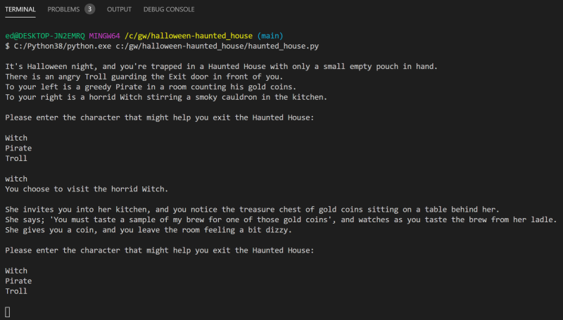
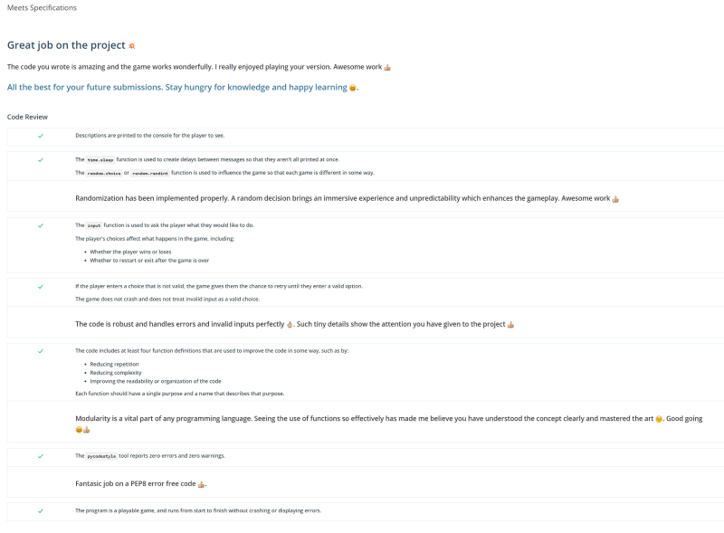

# halloween-haunted_house
___
## Objective
Create a halloween story using the python programming language.
___
## Table of Contents
* [Description](#description)
* [Layout](#layout)
* [Installation](#installation)
* [Usage](#usage)
* [License](#license)
* [Contributing](#contributing)
* [Questions](#questions)
* [Application_Review](#application_review)
## Description:
 This is a command-line app story about a haunted house including:
 - a witch
 - a pirate
 - a troll
_____
## Layout:
The user is trapped inside a haunted house, and must figure out a way to exit by visiting 3 characters inside the house: **witch**, **pirate**, and **troll**.
___
## Installation
(1) Open the **haunted_house.py** file in Visual Studio Code.   
(2) Right click anywhere inside the body of the code and select: **Run Python File in Terminal**.   
(3) Provide answers at the prompts to navigate through the haunted house.        
_____
## Usage
This is a "just for fun" app that tells a Halloween-related story. 
_____
## Contributing
ed-sivick
_____
## Questions
If there are any questions, or if you would prefer more information concerning this app,
please contact the following person at their GitHub profile or email address below:

* [GitHub Profile](https://github.com/ed-sivick)
* ed@sivick.net
_____
## License
You can view more information concerning software licenses at the following link:

* [License](https://opensource.org/licenses/MIT)
_____
## Badges

___
## Application_Review  
  
**Story sample and Application Review Image:** Hover the mouse over each image for a brief description.

  
  

  

  
  

  